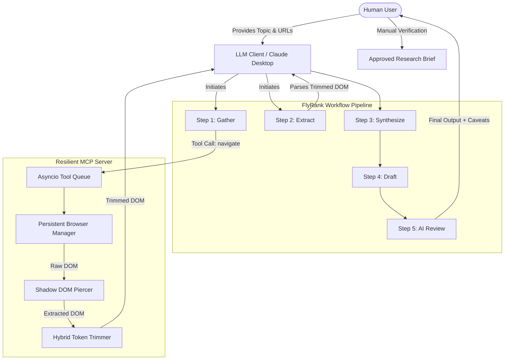

# Architecture

This diagram illustrates how the FlyRank Repeatable Workflow maps to the technical components of the Resilient MCP Server and the LLM Client.

```mermaid
flowchart TD
    User([Human User]) -->|Provides Topic & URLs| LLM[LLM Client / Claude Desktop]
    
    subgraph FlyRank Workflow Pipeline
        S1[Step 1: Gather]
        S2[Step 2: Extract]
        S3[Step 3: Synthesize]
        S4[Step 4: Draft]
        S5[Step 5: AI Review]
    end
    
    subgraph Resilient MCP Server
        BM[Persistent Browser Manager]
        TT[Hybrid Token Trimmer]
        SD[Shadow DOM Piercer]
        AL[Asyncio Tool Queue]
    end

    %% Workflow Execution Flow
    LLM -->|Initiates| S1
    S1 -->|Tool Call: navigate| AL
    AL --> BM
    BM -->|Raw DOM| SD
    SD -->|Extracted DOM| TT
    TT -->|Trimmed DOM| LLM
    
    LLM -->|Initiates| S2
    S2 -->|Parses Trimmed DOM| LLM
    
    LLM --> S3
    S3 --> S4
    S4 --> S5
    
    S5 -->|Final Output + Caveats| User
    User -->|Manual Verification| Final[Approved Research Brief]
```
